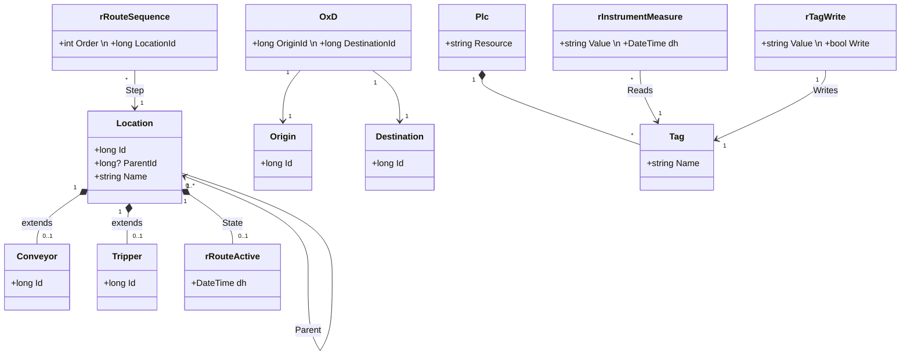

# 2. Modelo de Domínio e Infraestrutura (C# / EF)

A camada de domínio (`Vale.Tops.Domain`) e a camada de infraestrutura (`Vale.Tops.Integration.Infrastructure.DataBase`) foram construídas utilizando o **Entity Framework 6.4.4** no paradigma **Code-First**.

## 2.1 O Padrão Arquitetural `Location`
A entidade central do sistema é a classe **`Location`**. O sistema utiliza uma abordagem de **Composição 1-para-1** rigorosa (usando `[Key]` e `[ForeignKey]`). 

Para o motor de busca, tudo é um "Nó" (`Location`) com auto-referência (`ParentId`), permitindo modelar a planta em formato de árvore. Para as regras de negócio de intertravamento, os equipamentos assumem suas especializações técnicas (`Conveyor`, `Tripper`, `Plc`, `Tag`).

## 2.2 Diagrama de Classes Core (Domínio)

## 2.3 Camada de Persistência (CQRS)
O sistema implementa o Repository Pattern segregando as responsabilidades de leitura e escrita para evitar locks transacionais pesados no SQL:
WriteReadContext: Contexto do Entity Framework para transações ACID (Insert, Update, Delete). Ex: IWriteRead<Location>.
ReadOnlyContext: Contexto NoTracking utilizado puramente para leitura das Views e acionamento de Stored Procedures (como a sp_Route_Tag_Bool_Activate).
Autofac: Utilizado para injeção de dependência (InstancePerLifetimeScope), resolvendo as interfaces genéricas dos repositórios.
