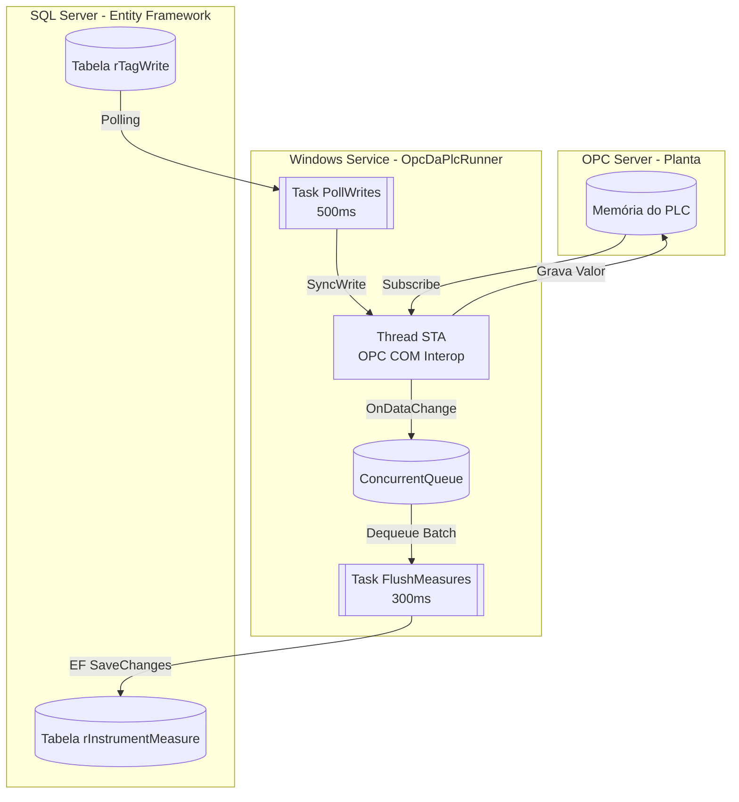

# 5. Integração Industrial (Windows Service OPC Client)

O projeto `OpcDaDriver.Service` é o verdadeiro "Gêmeo Digital". É um Windows Service autônomo e altamente resiliente que traduz a intenção do banco de dados (C# / SQL) em tensão elétrica nos painéis industriais (PLC) via protocolo **OPC DA** Clássico (COM/Interop).

## 5.1 Arquitetura Produtor-Consumidor (Padrão Multithread)
Para contornar a notória instabilidade do protocolo COM da Microsoft em .NET, a comunicação do OPC foi isolada:
* **Thread STA + Message Pump:** O OPC só conversa com uma thread única (`ApartmentState.STA`). Um laço Win32 nativo (`MsgWaitForMultipleObjects`) mantém a fila de mensagens do Windows viva para receber os callbacks.

## 5.2 Fluxo de Leitura (OnDataChange)
O sistema não faz polling de leitura, para não estrangular a rede industrial. Quando um bit muda na planta, o evento Group_DataChange joga o valor e o timestamp numa fila thread-safe. A cada 300ms, a Task FlushMeasuresLoopAsync esvazia a fila e aplica um update massivo no banco (Tabela rInstrumentMeasure).
## 5.3 Fluxo de Escrita (Ativação de Planta) 
A cada 500ms, a rotina PollWritesLoopAsync verifica a tabela rTagWrite.
* Quando uma tag tem a flag Write = 1, o serviço converte a String gerada pelo sistema de roteamento para o tipo binário exigido pelo controlador (CoerceToCanonicalVariant -> VT_BOOL, VT_R4).
* A instrução SyncWrite é enviada à Thread STA. Se não houver erros (HRESULT 0), a flag de escrita é limpa no banco.
## 5.4 Resiliência
* Algoritmo de Backoff Exponencial (2s até 60s) para evitar quedas no Switch Industrial caso o OPC Server fique indisponível.
* Verificador de saúde (Health Check) que acusa Staleness caso a média de atualização (UpdatesDelta) pare de progredir ou ultrapasse os 7 segundos.
## 5.5 Entendendo o Código do Driver (Guia para Iniciantes)
Se você tem pouca experiência com programação C# avançada, o código do driver OPC pode parecer um pouco intimidador à primeira vista. Existem termos como Thread STA, ConcurrentQueue e chamadas a bibliotecas obscuras como user32.dll.
Esta seção explica, de forma simples, como a classe principal do driver (OpcDaPlcRunner.cs) funciona nos bastidores.
### 1. Como o serviço ganha vida? (Program.cs e ServiceHost.cs)
Diferente de um aplicativo normal que tem telas e botões, um Windows Service roda invisível no fundo do computador.
Quando o serviço liga, ele lê o arquivo App.config para descobrir quem ele é (Exemplo: "Eu sou o serviço responsável pelo PLC número 176").
A classe ServiceHost prepara o terreno, cria uma pasta para salvar os arquivos de Log (o diário de bordo do sistema) e aciona a ignição chamando o método StartAsync() da classe OpcDaPlcRunner.
### 2. O Problema do Protocolo Antigo (O que é STA e Win32Pump?)
O protocolo OPC DA (Data Access) é uma tecnologia antiga criada nos anos 90, baseada em um padrão da Microsoft chamado COM.
O Problema: A tecnologia COM detesta programas modernos que fazem várias coisas ao mesmo tempo (Multithreading). Se duas partes do nosso código tentarem falar com o OPC ao mesmo tempo, ele trava e o sistema cai.
A Solução no Código: Nós isolamos o OPC em uma "sala à prova de som" chamada STA (Single-Threaded Apartment). É uma Thread exclusiva onde só uma coisa acontece por vez.
Para que serve o Win32Pump? Como a "sala do STA" não pode travar, usamos o Win32Pump (que chama ferramentas nativas do Windows como PeekMessage e TranslateMessage) para criar uma esteira rolante de mensagens. Se o PLC manda um dado, ele entra nessa esteira, garantindo que o programa não congele.
### 3. Como funciona a Leitura (O Padrão Produtor-Consumidor)
Imagine tentar escrever no banco de dados toda vez que um sensor no porto mudar de valor. Se 1.000 sensores mudarem em 1 segundo, faríamos 1.000 chamadas ao SQL Server, o que derrubaria o banco!
O código resolve isso de forma inteligente:
O Produtor (Group_DataChange): O PLC avisa o C# que um valor mudou. Em vez de ir ao banco de dados, o C# apenas escreve isso num "post-it" e joga dentro de uma caixa segura chamada _qMeasures (uma ConcurrentQueue - fila segura para múltiplas threads).
O Consumidor (FlushMeasuresLoopAsync): A cada 300 milissegundos, um "trabalhador" vai até essa caixa, pega todos os post-its de uma vez só e faz um único UPDATE gigante no banco de dados (SaveChanges). Isso deixa o sistema incrivelmente rápido e leve.
### 4. Como funciona a Escrita (Tradutor de Idiomas)
O método PollWritesLoopAsync acorda a cada 500 milissegundos e olha para o banco de dados (tabela rTagWrite) perguntando: "Tem alguma rota nova pedindo para ligar equipamentos?" (onde Write = 1).
Se houver, entra em cena a função CoerceToCanonicalVariant.
O Problema: O banco de dados envia textos (Strings), como "1", "0" ou "150.5". Mas o motor elétrico do PLC não entende texto. Ele exige formatos binários estritos como Byte, Booleano (Verdadeiro/Falso) ou Float.
O que a função faz: Ela funciona como um tradutor. Ela olha para o manual do PLC (it.CanonicalDataType), vê o que ele está esperando e converte o texto do banco de dados para o tipo exato. Se houver erro de digitação, ela bloqueia o envio e avisa no log, impedindo que o PLC entre em falha. Após traduzir, ela envia o comando via SyncWrite.
### 5. A Proteção contra Quedas de Rede (A classe Backoff)
Em portos e mineradoras, cabos de rede podem sofrer interferência e o switch industrial pode reiniciar.
Se o C# perder a conexão com o PLC, ele entra no bloco catch e tenta reconectar.
Mas ele não tenta reconectar loucamente 100 vezes por segundo (o que agravaria o problema da rede). A classe interna Backoff faz com que ele espere 2 segundos. Se falhar, ele espera 4 segundos. Se falhar, 8 segundos... até o limite de 60 segundos. Isso é uma boa prática de engenharia para sistemas industriais resilientes, dando tempo para o hardware da planta "respirar" e voltar à vida.
