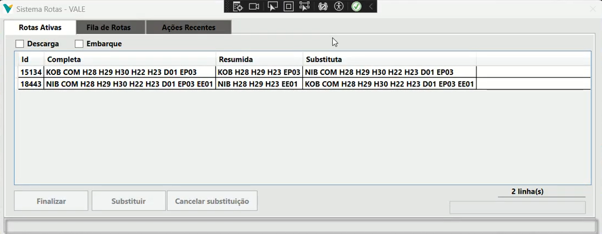
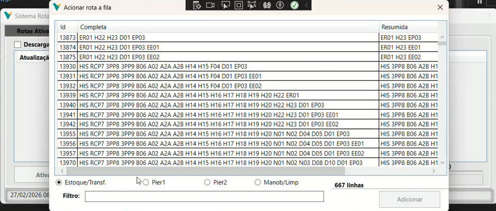
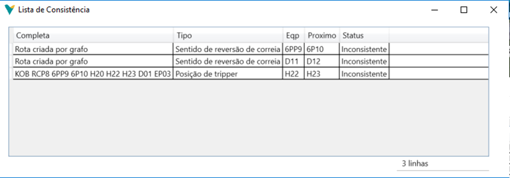
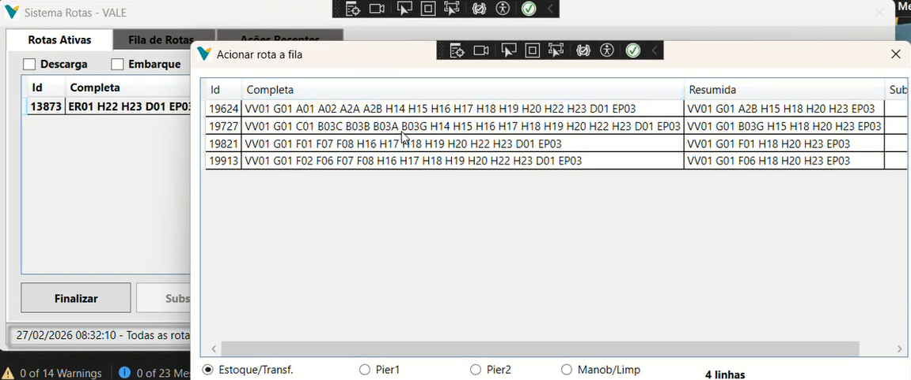
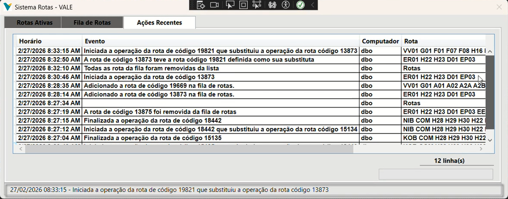

# 6. Manual de Operação do Sistema Rotas

O **Sistema Rotas** possui uma interface gráfica desenvolvida em WPF focada na usabilidade e na segurança operacional. Através desta tela, o operador do Centro de Controle (CCO) consegue planejar, iniciar, substituir e finalizar o fluxo de minério na planta.

Este manual descreve o passo a passo de utilização das três abas principais do sistema: **Rotas Ativas**, **Fila de Rotas** e **Ações Recentes**.

---

## 6.1. Visão Geral da Interface

A tela principal do sistema é dividida em abas de navegação no topo e filtros rápidos logo abaixo.

> 

* **Filtros de Modalidade:** As caixas de seleção `Descarga` e `Embarque` permitem ao operador limpar a tela e focar apenas nas rotas do processo desejado.
* **Barra de Progresso (Inferior):** Sempre que o sistema estiver consultando o banco de dados (buscando milhares de rotas), a barra inferior indicará que o sistema está processando a informação.

---

## 6.2. Aba "Fila de Rotas" (Planejamento)

A **Fila de Rotas** é a "sala de espera". Colocar uma rota nesta aba **não liga nenhum equipamento na planta**. Serve apenas para o operador planejar as próximas operações e verificar se elas são fisicamente possíveis.

### 6.2.1 Como Adicionar uma Rota na Fila
1. Navegue até a aba **Fila de Rotas**.
2. Clique no botão **`Adicionar`**.
3. A janela *"Acionar rota à fila"* será exibida, contendo todas as milhares de rotas possíveis cadastradas no sistema.
4. **Filtros Inteligentes:** Utilize os *Radio Buttons* na parte inferior (ex: *Estoque/Transf.*, *Píer 1*, *Píer 2*, *Manob/Limp*) para isolar os destinos. 
5. **Busca Rápida:** Digite o nome do equipamento de origem no campo **Filtro** (ex: `VV01` para Virador de Vagões 1) e pressione a barra de espaço para adicionar mais filtros (ex: `VV01 F04`).
6. Selecione a rota desejada na tabela e clique no botão **`Adicionar`**.

> 

### 6.2.2 Validação de Segurança (Consistência)
Antes de uma rota ser iniciada, a coluna **Consistente** (na Fila de Rotas) mostrará `Sim` ou `Não`. 
* Se estiver `Sim`, a rota pode ser ativada.
* Se estiver `Não`, significa que as máquinas físicas na planta não estão na posição correta.

**Como descobrir o problema:**
1. Selecione a rota com erro (`Consistente = Não`).
2. Clique no botão **`Consistência`**.
3. Uma janela abrirá mostrando exatamente qual máquina está impedindo a rota.
   * *Exemplo: A "Cabeça Móvel A2B" deveria estar virada para a correia "H14", mas está indefinida. Ou a "Posição do Tripper" está errada.*
4. O operador de campo deve corrigir a posição da máquina física antes de o sistema permitir a ativação.

> 

---

## 6.3. Aba "Rotas Ativas" (Operação da Planta)

Quando o operador seleciona uma rota `Consistente = Sim` na Fila de Rotas e clica no botão (ação de ativação), a rota desaparece da Fila e passa a ser exibida na aba **Rotas Ativas**. 

**Atenção:** Quando uma rota entra nesta aba, o Sistema Rotas envia os comandos OPC para o CLP. **As esteiras da planta estão rodando (ou prestes a rodar)**.

### 6.3.1 Como Finalizar uma Rota
Quando o trem ou o navio termina de ser carregado/descarregado:
1. Vá para a aba **Rotas Ativas**.
2. Selecione a rota desejada.
3. Clique no botão **`Finalizar`**.
4. O sistema desligará os motores da rota e removerá a linha da tela.

---

## 6.4. Substituição de Rotas (Operação Hot-Swap)

Este é um dos recursos mais poderosos do sistema. Ele evita que o porto seja totalmente desligado quando precisamos trocar apenas a máquina de origem (Exemplo: O trem no Virador 01 acabou, mas já existe um trem pronto no Virador 02 que vai usar as mesmas esteiras de destino).

### Como realizar a Substituição:
1. Na aba **Rotas Ativas**, selecione a rota atual que está rodando (ex: a rota do `VV01`).
2. Clique no botão **`Substituir`**.
3. A janela de adição será aberta **mostrando apenas as rotas compatíveis** (que terminam no mesmo destino da rota atual).
4. Selecione a nova rota (ex: a rota do `VV02`) e clique em **Adicionar**.
5. Na tela principal, a coluna *Substituta* será preenchida com a nova rota.
6. **O Pulo do Gato:** Clique em **`Finalizar/Substituir`** na rota original.
7. O sistema **não desligará** as esteiras em comum. Ele apenas desligará o maquinário do `VV01` e ligará o maquinário exclusivo do `VV02`, economizando tempo e energia elétrica.

> 

---

## 6.5. Aba "Ações Recentes" (Logs)

A aba **Ações Recentes** é a caixa preta do sistema (Trilha de Auditoria). 
* Toda ação realizada pelos operadores da sala de controle (Adicionar rota na fila, Finalizar Rota, Substituir Rota) é registrada instantaneamente.
* A tela exibe a **Data/Hora (Horário)**, o evento detalhado, o nome do **Computador** de onde partiu o comando e a Rota afetada.

Isso garante total transparência sobre a operação da planta, ajudando as equipes de engenharia e manutenção a entenderem o histórico de eventos durante a investigação de paradas operacionais.

> 
